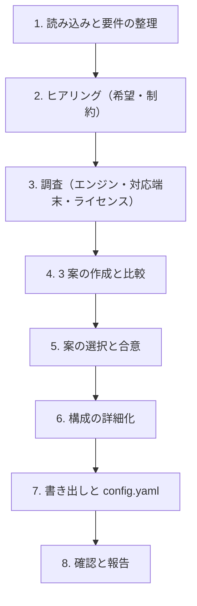

# gamekit-architecture スキル（遊びの設計 → エンジンと構成）

`docs/game/` の遊びの設計を実現するエンジン、言語、構成を決め、`docs/architecture.md` に書く。ここで決めたことは、憲章（G9 `speckit-constitution`）、共通基盤（G11 `gamekit-foundation`）、非機能要件（G12 `gamekit-nfr`）、各機能の `plan.md`、`.gamekit/config.yaml` の `commands` の前提になる。

パスは `.gamekit/config.yaml` の `paths` で読み替える（以下は既定のパス）。

## 0. 大原則

- **推測で決めない。** 選定の根拠にしてよいのは、(a) `docs/concept/` と `docs/game/` に書かれた要件、(b) ユーザーの回答、(c) 出典付きの調査結果の 3 つだけ。
- **3 案を必ず比べる。** ユーザーがエンジンを決めていても、比較の基準として 3 案を示す（決めているエンジンを 1 案に含め、その言語違いや、規模の違う別のエンジンを並べる）。
- **AI と回せる構成を重視する。** gamekit はエージェントがテスト、ヘッドレス実行、バランスのシミュレーションを自分で回して確かめる。コマンドラインでテストとシミュレーションを実行できるかを、比較の観点に必ず入れる。エディタでしか確かめられない構成は、その分の `[人]` の作業が増えることを示す。
- **数値はデータに置く。** マスタデータの形式（JSON、CSV、Godot の `.tres` など）と置き場所（`paths.data`）を決め、調整値をコードに直接書かない構成にする（steering の原則 4）。`gamekit-balance` の `params` が自動で確かめられるのは JSON だけである。JSON 以外を選ぶ場合はその旨を書く。
- **事実は変わる。** エンジンのバージョン、対応端末、ライセンス、ストアの手数料には、出典 URL と参照日を付ける。出典のない事実は書かない。エンジンごとの定石は [references/godot.md](./references/godot.md) と [references/web.md](./references/web.md) にまとめてあるが、実行のたびに公式の文書で確かめる。
- **書き出す前に合意を取る。** 自動モード（`--auto`。`gamekit-bootstrap` の自動モードと一括質問モードからはこのモードで呼ばれる）では、§6 の規則で決めて記録する。
- ドキュメントは日本語で書く。識別子、エンジン名、コマンドは原文のままでよい。

## 1. 引数と入出力

```text
$ARGUMENTS
```

引数は、追加の希望や制約として扱う（例: 「Godot を使いたい」「Steam と iOS に出す」）。`--auto` は位置を問わず、希望として扱う前に取り除く。

| 入力 | 用途 |
|---|---|
| `docs/concept/seed.md`、`premises.md` | GP2（遊ぶ場面）、GP3（プラットフォームと操作）、GP10（スコープ）、GP11（収益化）、チームの人数とスキル |
| `docs/game/core-loop.md`、`systems.md`、`economy.md`、`progression.md` | リアルタイム性、物理、シミュレーションの規模、オンライン要素、データの量 |
| `docs/game/prototype/` | 机上検証で使った言語やスクリプト（流用できるか） |
| `docs/research/competitors.md` | 参考作品のエンジンと規模（判断の材料。根拠にはしない） |
| `.specify/memory/constitution.md` | すでにある場合は、その原則に従う |

| 出力 | 役割 |
|---|---|
| `docs/architecture.md` | 採用したエンジンと構成、技術スタック、データ駆動の方式、セーブ、決定性、テスト、比較した案と却下した理由、見直しの条件、出典。様式は [templates/architecture.md](./templates/architecture.md) |
| `.gamekit/config.yaml` | `engine`、`language`、`paths.data`、`commands`（`test`、`lint`、`build`、`run_headless`、`balance_sim`） |

終わったら、`gamekit-bootstrap` §3 の形で G8 を記録する（`docs(bootstrap): G8 エンジンと構成を選定`、trailer `Gamekit-Bootstrap: G8`）。単独で実行したときも記録する。見直しモードでは記録しない（`docs(architecture): <変更の要約>` の通常のコミットにする）。

`docs/architecture.md` がすでにある場合は、**見直しモード**として §4 に従う。既存のプロジェクトに取り込んだ場合（`--adopt`）は、既存のエンジンとコードを読み、現状を記録する形で書く（§5）。

## 2. 手順



### ステップ 1: 読み込みと要件の整理

入力を読み、構成に効く要件を整理する。この段階では決めない。

- **対応端末と操作**: PC（Windows / macOS / Linux）、モバイル（iOS / Android）、Web ブラウザ、家庭用ゲーム機。操作（キーボードとマウス、ゲームパッド、タッチ）
- **表現**: 2D / 3D、画面の解像度の方針、演出の量
- **処理の重さ**: リアルタイムか、ターン制か。同時に動く物体の数、経路探索、シミュレーションの規模（`systems.md`）
- **オンライン**: なし / 非同期（ランキング、クラウドセーブ）/ リアルタイムの対戦や協力。サーバーが要るか
- **データ**: マスタデータの量と種類（敵、アイテム、成長曲線、会話など）、ローカライズの言語数、セーブの大きさ
- **チーム**: 人数、得意な言語、アートの作り方（ドット絵、3D モデル、外注）
- **スコープ**: 最初の垂直スライスまでの期間（GP10）

### ステップ 2: ヒアリング

AskUserQuestion で、次の項目のうち `docs/` で決まっていないものを聞く。1 ラウンド最大 4 問、推奨案を先頭に `(Recommended)` を付けて置く。

| ID | 項目 | 例 |
|---|---|---|
| E1 | 使いたい、または避けたいエンジン | Godot / Unity / Unreal / Web（Phaser、PixiJS、素の Canvas）/ 指定なし |
| E2 | 書きたい言語 | GDScript / C# / TypeScript / 指定なし |
| E3 | 最初に出す端末と、後で足したい端末 | Steam（Windows）だけ / Steam と Web / iOS と Android |
| E4 | 家庭用ゲーム機への移植の見込み | なし / いずれは / 最初から |
| E5 | オンライン要素とサーバーの運用 | なし / 非同期のみ / リアルタイム |
| E6 | 費用とライセンスの制約 | 無料のものだけ / 売上に応じた手数料は許容 / 制約なし |
| E7 | マスタデータを誰が編集するか | AI と開発者がテキストで / 表計算ソフトで / エンジンのエディタで |
| E8 | 既存の資産 | 既存のコード、アセット、ツール、机上検証のスクリプト |

- 回答から新しい論点が出たら、次のラウンドで聞く。
- 回答は `docs/architecture.md` の「前提と制約」に、項目 ID を付けて記録する。

### ステップ 3: 調査

WebSearch と WebFetch で、候補のエンジンの最新の安定版、対応端末（言語ごとの制約を含む。例: Godot 4 の C# は Web に書き出せない）、ライセンスと費用、コマンドラインでのテストとヘッドレス実行の方法、ストアの要件（手数料、審査）を調べる。

- [references/godot.md](./references/godot.md)、[references/web.md](./references/web.md) の「確かめること」を、公式の文書で確かめる。
- 事実には出典 URL と参照日を付ける。

### ステップ 4: 3 案の作成と比較

要件に合う 3 案を作る。系統の例は次のとおりである。premises と制約から、比べる意味のある 3 つを選ぶ。

| 系統 | 例 | 向いている場面 |
|---|---|---|
| Godot（GDScript） | Godot 4 + GDScript + GUT | 2D 中心、小さなチーム、テキストで扱えるシーン、無料 |
| Godot（C#） | Godot 4 .NET + C# + gdUnit4Net / xUnit | 型と既存の .NET の資産を使いたい。Web への書き出しが要らない |
| Web | TypeScript + Vite + Canvas / PixiJS / Phaser + Vitest | ブラウザで遊ぶ、UI が多い、シミュレーションを Node で回したい |
| 汎用エンジン | Unity（C#）/ Unreal（C++、Blueprint） | 3D、家庭用ゲーム機への移植、アセットストアを使う |
| サーバーあり | 上のいずれか + サーバー（Go、Node など） | リアルタイムの対戦や協力、運営型 |

各案について、次を比べる。

- 構成の概要（エンジン、言語、描画、データ、セーブ、テスト、ビルド）
- 対応端末（E3、E4）への適合と制約
- **AI と回せるか**: コマンドラインでテスト、ヘッドレス実行、バランスのシミュレーションができるか。シーンやリソースをテキストで書けるか
- チームのスキル（E2）、学ぶ費用
- 費用とライセンス（E6）
- 性能の上限（ステップ 1 の処理の重さ）
- 別の案へ移るときの費用
- 主なリスク

### ステップ 5: 案の選択と合意

比較表と推奨案（理由付き）を示し、AskUserQuestion で選んでもらう。組み合わせを希望されたら、案を作り直して再提示する。合意するまで書き出さない。

### ステップ 6: 構成の詳細化

選ばれた案について、次を決める。判断が分かれるものは質問する。エンジンごとの定石は references を見る。

- **エンジンのバージョン**と、上げる方針
- **プロジェクトの構成**: ディレクトリ（シーン、スクリプト、データ、テスト、ツール）、シーンやモジュールの分け方
- **ゲームのロジックと表示の分け方**: ルールと数値の計算を、描画やエンジンのノードから分けて、テストとシミュレーションで直接呼べるようにする（ヘッドレスでのバランスのシミュレーションの前提）
- **データ駆動**: マスタデータの形式、置き場所（`paths.data`）、読み込みと検証の方法、スキーマ（JSON Schema など）を置くか
- **セーブとマイグレーション**: 形式、置き場所、バージョン番号、古いセーブの読み込み
- **決定性**: 乱数の生成器とシードの扱い（シミュレーションとリプレイで同じ結果になるか）、固定のタイムステップ
- **入力**: 入力の抽象化（アクション名）と割り当ての変更
- **ローカライズ**: 文言の置き場所と形式
- **テスト**: フレームワーク、テストの種類（ロジックの単体テスト、シーンの結合テスト、シミュレーション）、実行のコマンド
- **バランスのシミュレーション**: 実行の仕組み（Godot なら `--headless --script`、Web なら Node のスクリプト）と、出力の形式（`gamekit-balance` の §2 の JSON）
- **ビルドと書き出し**: 対象の端末、書き出しの設定、署名（`[人]`）
- **CI**: テスト、ヘッドレス実行、シミュレーションを自動で回すか（999 で扱う）
- **アセット**: 形式、置き場所、ライセンスの記録
- **オンライン**（ある場合）: サーバーの構成、費用の概算（出典付き）

### ステップ 7: 書き出しと config.yaml

1. [templates/architecture.md](./templates/architecture.md) に沿って `docs/architecture.md` を書く。構成図は mermaid で描く。
2. `.gamekit/config.yaml` を埋める。ファイルがなければ先に作る。

   ```bash
   python3 <skills>/gamekit-status/scripts/gamekit.py init --config-only --engine <godot|web|other> --language <言語>
   ```

   `<skills>` は、このスキルが置かれた skills ディレクトリである。続けて `paths.data` と `commands` の各項目を、ステップ 6 で決めたコマンドで手で書く。まだ存在しないもの（テストのフレームワークの導入前など）も、導入した後に使うコマンドを書き、`docs/architecture.md` の「開発のコマンド」に「000 で導入する」と注記する。
3. `balance_sim` には `{scenario}` と `{out}` を必ず含める（`gamekit-balance` が置き換える）。

### ステップ 8: 確認と報告

1. `python3 <skills>/gamekit-status/scripts/gamekit.py doctor` を実行する。エンジンをまだ入れていない環境では、コマンドが PATH にないという WARN が出るので、報告に含める（ERROR は直す）。
2. 次を日本語で報告する。
   - 採用した案と、主な理由
   - 技術スタックの要約（エンジン、言語、データの形式、テスト、シミュレーションの実行方法）
   - `config.yaml` に書いたコマンド
   - 対応端末の制約と、`[人]` になる作業（エンジンの導入、書き出しのテンプレート、署名など）
   - 見直しの条件
   - 次の手順の案内（G9 `speckit-constitution`。`gamekit-bootstrap` の中で実行している場合は、その手順に戻る）

## 3. 記述の規則

- 各機能の詳細な設計（クラス、シーンの構成、データの項目）は書かない。それは各機能の `plan.md` で決める。ここに書くのは、全機能が従う共通の構成である。
- 却下した案も、理由と、どういう条件なら再検討するかとともに残す。
- 「見直しの条件」には、具体的な基準を書く（例: 同時に動く物体が 500 を超えて 60 fps を保てない、家庭用ゲーム機への移植が決まった）。

## 4. 見直しモード

`docs/architecture.md` がすでにある場合は、次の手順で見直す。

1. 既存の内容と、見直しのきっかけ（引数、新しい機能、見直しの条件に達したこと）を確かめる。
2. 変える部分と、その影響（既存の機能の `plan.md`、憲章、`docs/nfr.md`、マスタデータ、セーブの互換、`config.yaml` の `commands`）を示し、合意を取る。
3. 合意した変更だけを反映し、「変更履歴」に日付、内容、理由を足す。`config.yaml` も合わせて直す。

エンジンや言語を変える見直しは、自動モードでは行わない（止まって報告する）。

## 5. 既存のプロジェクトへの取り込み

`docs/architecture.md` がなく、エンジンのプロジェクト（`project.godot`、`package.json`、`*.csproj`、`go.mod` など）がすでにある場合は、選び直さずに現状を記録する。

1. 既存のコード、設定ファイル、README、既存の設計資料（例: `docs/designs/architecture.md`、`docs/production/architecture.md`）を読む。元のファイルは動かさない・消さない。
2. ステップ 6 の項目ごとに、現状（ファイルの場所を添える）と、gamekit の原則（数値はデータに置く、ロジックと表示を分ける、決定性、ヘッドレスのテスト）との差を書く。差は「見直しの候補」として節を分けて書き、すぐには直さない。
3. 3 案の比較の節には「取り込み時点の構成を記録した。比較はしていない」と書く。
4. 既存のテストとビルドのコマンドを `config.yaml` に書く。バランスのシミュレーションがあれば（例: `game/tools/balance_sim.gd`）、`gamekit-balance` の出力の形式に合わせるための差分を「見直しの候補」に書く。

## 6. 自動モード（`--auto`）

| 論点 | 自動モードでの動作 |
|---|---|
| ヒアリング（E1〜E8） | 入力から推奨案を作って採用する。根拠がなければ、2D なら Godot 4 + GDScript、ブラウザで遊ぶことが前提なら Web（TypeScript + Vite + Vitest）を採る。AI がコマンドラインでテストとシミュレーションを回せる案を優先する |
| 調査 | 省かない。Web を調べられない環境では「未確認」と書いて進め、見直しの優先度を「高」にする |
| 3 案からの選択、構成の詳細 | 推奨案を採用する。比較表は残す |
| 既存のエンジンを変えること | しない。止まって報告する |

- 自動で決めたことは `docs/auto-decisions.md` に記録する（`gamekit-bootstrap` §7 の書き方）。エンジン、言語、対応端末は、見直しの優先度を「高」にする。
- `docs/architecture.md` の「前提と制約」の該当する回答に `(auto: 仮定)` を付ける。

## 7. 禁止事項

- 出典のない事実（バージョン、対応端末、ライセンス、手数料）を書くこと
- ユーザーの合意なしに `docs/architecture.md` を書き出す、または上書きすること（自動モードを除く）
- 3 案の比較を省くこと（取り込みを除く）
- 各機能の詳細設計をここに書くこと
- コマンドラインで確かめられないことを、確かめたように書くこと
