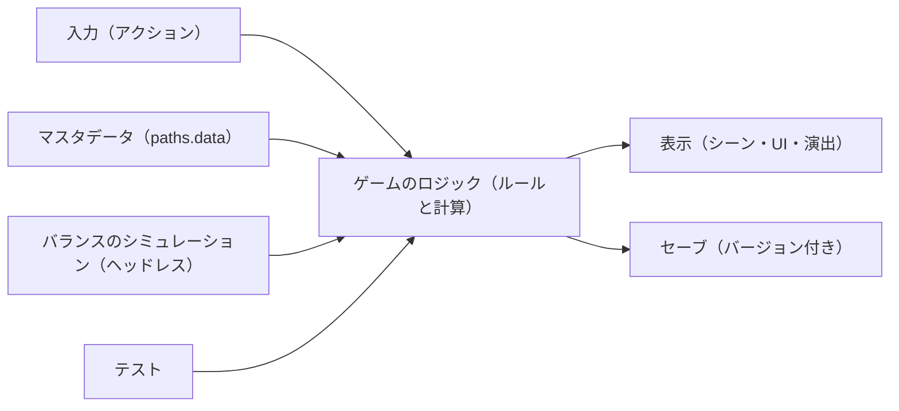

# アーキテクチャ

**最終更新**: <YYYY-MM-DD> | **採用案**: <例: Godot 4 + GDScript>

このゲームの全機能が従う、エンジン、構成、技術スタック。各機能の `plan.md` は、この文書と `docs/nfr.md` に従う。変更するときは `gamekit-architecture` の見直しモードで行う。コマンドの正本は `.gamekit/config.yaml` の `commands` であり、この文書の「開発のコマンド」はその説明である。

## 1. 前提と制約

### 要件の要約

- **対応端末と操作**: <最初に出す端末、後で足す端末、操作（GP3）>
- **表現**: <2D / 3D、解像度の方針>
- **処理の重さ**: <リアルタイム / ターン制、同時に動く物体の数、シミュレーションの規模>
- **オンライン**: <なし / 非同期 / リアルタイム>
- **データ**: <マスタデータの種類と量、ローカライズの言語数>
- **チームとスコープ**: <人数、得意な言語、最初の垂直スライスまでの期間（GP10）>

### ヒアリングの回答

| ID | 項目 | 回答 |
|---|---|---|
| E1 | 使いたい / 避けたいエンジン | <回答> |
| E2 | 書きたい言語 | <回答> |
| E3 | 最初に出す端末と、後で足したい端末 | <回答> |
| E4 | 家庭用ゲーム機への移植の見込み | <回答> |
| E5 | オンライン要素とサーバーの運用 | <回答> |
| E6 | 費用とライセンスの制約 | <回答> |
| E7 | マスタデータを誰が編集するか | <回答> |
| E8 | 既存の資産 | <回答> |

## 2. 採用した構成



<構成の説明。ロジックと表示をどう分けるか、なぜこの構成にしたか。>

## 3. 技術スタック

| 領域 | 採用 | 理由 |
|---|---|---|
| エンジンとバージョン | <例: Godot 4.x（安定版）> | <理由> |
| 言語 | <例: GDScript（静的型付け）> | <理由> |
| 描画・UI | <例: Godot の Control ノード> | <理由> |
| マスタデータ | <形式（JSON など）と置き場所 `<paths.data>`、スキーマ> | <理由> |
| セーブ | <形式、置き場所、バージョンとマイグレーション> | <理由> |
| 乱数と決定性 | <生成器、シードの扱い、固定のタイムステップ> | <理由> |
| 入力 | <アクション名による抽象化、割り当ての変更> | <理由> |
| ローカライズ | <形式と置き場所> | <理由> |
| テスト | <フレームワーク、テストの種類> | <理由> |
| バランスのシミュレーション | <実行の仕組み、出力の形式（gamekit-balance §2）> | <理由> |
| ビルドと書き出し | <対象の端末、書き出しの設定> | <理由> |
| CI | <例: GitHub Actions（999 で作る）> | <理由> |
| アセット | <形式、置き場所、ライセンスの記録> | <理由> |
| サーバー（ある場合） | <構成> | <理由> |

### ディレクトリ構成

```text
<例:
game/
├── project.godot
├── scenes/       # シーン（表示）
├── scripts/      # ロジックと表示のスクリプト
├── data/         # マスタデータ（paths.data）
├── tests/        # テスト
└── tools/        # バランスのシミュレーションなどのツール>
```

### 開発のコマンド

`.gamekit/config.yaml` の `commands` に書いたもの。

| 用途 | `commands` のキー | コマンド |
|---|---|---|
| テスト | `test` | <コマンド> |
| リンター・フォーマッター | `lint` | <コマンド> |
| ビルド | `build` | <コマンド> |
| ヘッドレス実行 | `run_headless` | <コマンド> |
| バランスのシミュレーション | `balance_sim` | <`{scenario}` と `{out}` を含むコマンド> |

## 4. 設計の決め事

- **ロジックと表示の分離**: <ルールと計算をどこに置き、テストとシミュレーションからどう呼ぶか>
- **数値はデータに置く**: <調整値を読む仕組み。コードに直接書かないこと>
- **決定性**: <同じシードで同じ結果になる範囲>
- **セーブの互換**: <バージョンの上げ方、古いセーブの読み込み>
- **エディタでしかできない作業**: <シーンの配置、インポートの設定など。テキストで書く方針か `[人]` にするか>

## 5. 費用とライセンス

参照日: <YYYY-MM-DD>

| 項目 | 費用・条件 | 出典 |
|---|---|---|
| <エンジン> | <例: MIT ライセンス、無料> | <URL> |
| <ストア> | <手数料、登録料> | <URL> |
| <サーバー（ある場合）> | <月額の概算> | <URL> |

## 6. 比較した案

| 観点 | <案 A> | <案 B> | <案 C> |
|---|---|---|---|
| 構成の概要 | <概要> | <概要> | <概要> |
| 対応端末への適合 | <評価> | <評価> | <評価> |
| AI と回せるか（CLI のテスト・ヘッドレス・シミュレーション） | <評価> | <評価> | <評価> |
| チームのスキル | <評価> | <評価> | <評価> |
| 費用とライセンス | <評価> | <評価> | <評価> |
| 性能の上限 | <評価> | <評価> | <評価> |
| 移行の費用 | <評価> | <評価> | <評価> |

### 却下した案と理由

- **<案>**: <却下した理由。どういう条件なら再検討するか>

## 7. 見直しの候補

<既存のプロジェクトに取り込んだときだけ書く。gamekit の原則との差と、直す案。なければ節ごと削除する>

## 8. 見直しの条件

次のいずれかに当てはまったら、`gamekit-architecture` の見直しモードで構成を見直す。

- <例: 同時に動く物体が N を超えて、docs/nfr.md のフレームレートを保てない>
- <例: 家庭用ゲーム機への移植が決まった>

## 9. 出典

- <エンジンの公式文書>: <URL>（参照日 <YYYY-MM-DD>）

## 変更履歴

| 日付 | 変更内容 | 理由 |
|---|---|---|
| <YYYY-MM-DD> | 初版 | — |
