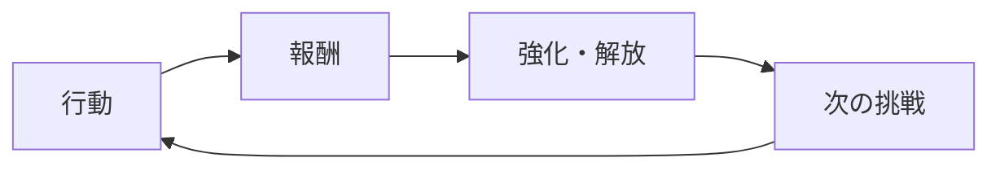

# コアループ

**作品**: [TITLE] | **版**: 1 | **最終更新**: [DATE] | **検証**: 未検証 / 一部検証済み / 検証済み（`docs/game/prototype/results.md`）

## 1 文で

> プレイヤーは [行動] して [報酬] を得て、それで [強化・解放] し、より [挑戦] に向かう。

## ループの図

## 3 つの層

| 層 | 時間の長さ | プレイヤーがすること | 意思決定 | 報酬・手応え | 対応する柱 |
|---|---|---|---|---|---|
| 瞬間（秒） | 1〜30 秒 | | | | |
| セッション（分） | 5〜30 分 | | | | |
| 長期（時間・日） | 数時間〜 | | | | |

## 主要な意思決定

プレイヤーが繰り返し迷う選択。正解が 1 つに決まる選択は意思決定ではない（支配戦略）。

| ID | 選択 | 選択肢 | 何と何を天秤にかけるか | 正解が状況で変わる理由 |
|---|---|---|---|---|
| D1 | | | | |

## 資源の流れ（概略）

主な資源と、入口（手に入る）・出口（使う・失う）。詳しい経済は `docs/game/economy.md`（G7）で書く。

| 資源 | 入口 | 出口 | ため込むと何が起きるか |
|---|---|---|---|

## 失敗と再挑戦

失敗したときに失うもの、残るもの、次の挑戦までの時間。

## 仮説

このループが面白いと言えるために、正しくなければならないこと。反証できる形で書き、`gamekit-prototype`（G6）で確かめる。

| ID | 仮説 | 反証の条件（こうなったら仮説は誤り） | 確かめ方の案 | 状態 |
|---|---|---|---|---|
| H1 | | | | 未検証 |

## 変更の記録

| 日付 | 変更 | 理由（検証の結果など） |
|---|---|---|
