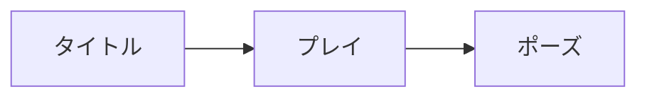

# 画面と体験の設計: <ゲーム名>

**作成日**: YYYY-MM-DD | **最終更新**: YYYY-MM-DD

<!--
画面と HUD の振る舞いの共通の決め事を書く（見た目は DESIGN.md、手触りは FEEL.md）。
画面一覧は、機能ごとの画面仕様（specs/<NNN-name>/ui.md）が詳細の正本であり、ここは全体の目次として使う。
画面 ID は SCR-<機能番号 3 桁>-<連番 2 桁>（例: SCR-001-01）。HUD も画面として ID を振る。機能番号は docs/feature/ のファイル名の先頭の番号である。
-->

## 情報設計

- **全体の構成**: タイトル、メインのプレイ画面、メニュー（ポーズ）、主な下位の画面の関係
- **入口**: 起動してから遊び始めるまでの流れ（初回とそれ以降の違い。チュートリアル）
- **操作の基本**: 決定・戻る・メニューの操作の割り当て（端末ごと）。マウス、ゲームパッド、タッチでの違い

## 画面一覧

| ID | 画面 | 機能 | 種類 | 状態 |
|---|---|---|---|---|
| SCR-000-01 | タイトル | 000-game-foundation | 画面 | 構想 |
| SCR-000-02 | ポーズメニュー | 000-game-foundation | 重ねる画面 | 構想 |
| SCR-001-01 | 戦闘の HUD | 001-<slug> | HUD | 構想 |

<!-- 種類: 画面 / 重ねる画面（ポーズ、ダイアログ）/ HUD。状態: 構想（立ち上げで挙げただけ）/ 仕様化済み（ui.md がある） -->

## 画面遷移

## 状態のパターン

| 状態 | 表示の方針 |
|---|---|
| 読み込み中 | 1 秒を超えそうなら、読み込み中であることを示す。操作を受け付けない間は分かるようにする |
| 一時停止 | ゲームの時間が止まっていることが分かる。戻る操作が常に同じ |
| セーブ中 | セーブ中は電源を切らないよう示す（自動セーブを含む） |
| 失敗（ゲームオーバー） | 何が原因かと、次に何ができるか（やり直し、ロード）を示す |
| 取得・達成 | 短く知らせ、プレイを止めない（止めるのは大きな節目だけ） |
| エラー（セーブの失敗など） | 何が起きたか、プレイヤーに何ができるかを示す。技術的な詳細は出さない |

## 言葉づかい

- **文体**: 例: システムの文言は です・ます調、登場人物の台詞はキャラクターごと（台詞の決まりは各機能か、シナリオの資料で決める）
- **用語**: ゲームの中の用語と、使わない言い換え（`docs/game/systems.md` の用語と合わせる。オマージュ元の固有の用語を使わない）
- **数値の表し方**: 例: 桁区切り、単位、増減の記号

## 言語とローカライズ

- **対応する言語**: `docs/nfr.md` の NFR-UX に従う（例: 日本語、のちに英語）
- **文言の置き場所**: マスタデータか翻訳ファイル。コードに直接書かない（`.kiro/steering/language.md` の「ゲームの中の文言」）
- **長さの違い**: 英語などで長くなるときの扱い（折り返し、縮小、省略の可否）
- **書体**: 言語ごとの書体（`DESIGN.md` の「文字」）

## アクセシビリティ

- **水準**: `docs/nfr.md` の `NFR-UX` に従う
- **最低限守ること**: 例: 色だけで情報を伝えない、重要な音には画面の表示を添える、操作の割り当てを変えられる、文字の大きさを変えられる
- **確かめ方**: 例: レビュー（`gamekit-review` の Feel 軸）と、実機での確認（`[人]`）

## 変更履歴

| 日付 | 内容 | 理由 |
|---|---|---|
| YYYY-MM-DD | 作成 | — |
