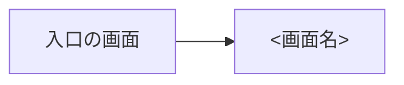

# 画面仕様: <FEATURE_NAME>

**対象**: UI あり | **作成日**: YYYY-MM-DD | **モック**: なし

<!--
この機能の画面と HUD を、spec.md の要件（FR-xxx）と対応づけて書く。見た目・振る舞い・手触りの共通の決め事は
docs/design/DESIGN.md、EXPERIENCE.md、FEEL.md に従い、ここには機能に固有のことだけを書く。
技術（エンジンのノード、ライブラリ）と具体的な数値（調整値）は書かない。技術は plan.md、調整値は tuning.md（S4-2）で決める。
画面のない機能は、ヘッダを「**対象**: UI なし」にし、理由を 1 行書いて以降の節を省く。
--with-mock のときは、ヘッダの「モック」に Claude Design のアーティファクトの URL を書く。
-->

## 画面一覧

| ID | 画面 | 種類 | 目的 | 対応する要件 |
|---|---|---|---|---|
| SCR-NNN-01 | <画面名> | <画面 / 重ねる画面 / HUD> | <この画面でプレイヤーが判断・達成すること> | FR-001, FR-002 |

## 画面遷移

## 画面ごとの仕様

### SCR-NNN-01 <画面名>

- **表示する情報**: 項目と並び順、プレイヤーが判断に使う情報が何か、件数が多いときの扱い
- **操作**: 操作（アクション名）と、その結果（どの画面に移るか、何が起きるか）。ゲームパッドでのフォーカスの動き
- **状態**: 読み込み中 / 一時停止 / 失敗 などの表示（`EXPERIENCE.md` の方針と違う点だけ）
- **使うコンポーネント**: `DESIGN.md` のコンポーネントの名前
- **端末による違い**: 解像度、タッチ、ゲームパッドで変わる点
- **アクセシビリティ**: この画面に固有の注意

## 演出とフィードバック

| 出来事 | 見た目 | 音 | 揺れ・止め | 対応する要件 |
|---|---|---|---|---|
| <例: 収穫した> | <例: 作物が跳ねて所持品に飛ぶ> | <例: 取得の音> | <なし> | FR-003 |

<!-- FEEL.md の方針と違う点だけを書く。強さや長さの値は tuning.md かトークンで決める。演出のない機能は「なし」と書く -->

## 文言

| 場所 | 文言のキー | 文言（既定の言語） |
|---|---|---|
| <ボタン、見出し、通知など> | <例: farm.harvest.done> | <文言> |

## プレイ確認の観点

<!-- FEEL.md の観点（FEEL-NNN）から、この機能で見るものを選び、機能に固有の観点を足す。tasks.md の [人] のプレイ確認のタスクがここを参照する -->

- FEEL-001: <この機能でどう確かめるか>

## 未決事項

- なし
