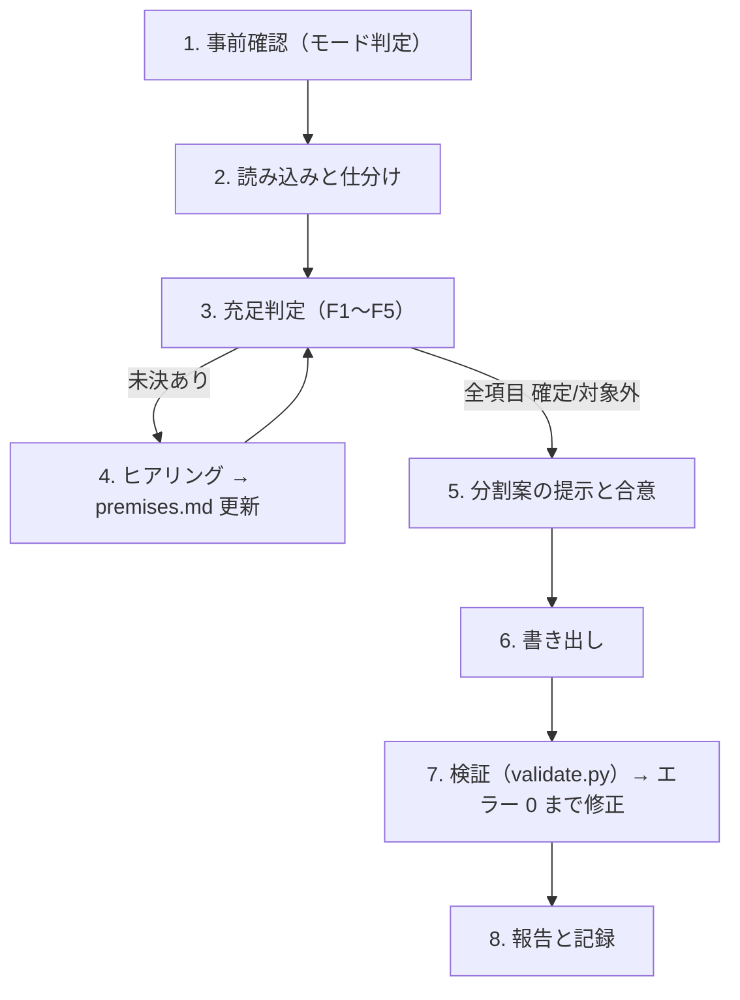

# gamekit-features スキル（遊びの設計 → 機能概要への仕分け）

ゲームの設計を読み、**`/speckit-specify` に 1 回で渡せて、プレイヤーとしてのユーザーストーリーと、遊んで確かめられる受入基準が書ける塊**に機能を仕分ける。出力は `gamekit-feature` / `gamekit-all` の入力（`docs/feature/spec_order.md` と `docs/feature/NNN-<slug>.md`）になる。`speckit-concept-2-feature` のゲーム版である。

パスは `.gamekit/config.yaml` の `paths` で読み替える（以下は既定のパス）。

## 0. 大原則

- **推測で埋めない。** 機能の根拠にしてよいのは、(a) `docs/concept/` と `docs/game/` のゲーム固有の記述、(b) ユーザーの回答（`docs/feature/premises.md` の質疑記録）の 2 つだけ。参考作品の調査（`docs/research/competitors.md`）は、選択肢と推奨案の材料であり、ユーザーが採用して初めて根拠になる。
- **遊べる単位で切る。** 機能は「プレイヤーが 1 つの遊び（意思決定と報酬）を得る」縦割りにし、その遊びに要るルール、データ、画面、演出を含める。「データ基盤」「UI 全般」のような横割りの機能は作らない（例外は §3）。
- **垂直スライスを最短で作る。** 区分の最初は **垂直スライス**（GP10。コアループを 1 周、通して遊べる最小の組み合わせ）にする。プロトタイプの検証（`docs/game/prototype/results.md`）で「保留」「棄却」の仮説に頼る機能は、垂直スライスに入れない。
- **共通基盤とリリース基盤は機能にしない。** セーブ、入力、マスタデータの読み込み、乱数、設定、ローカライズの仕組み、デバッグ用の機能（000 の候補）と、書き出し、CI、配布、クラッシュの記録（999 の候補）は、`docs/feature/premises.md` の「基盤の候補」に記録する。`gamekit-foundation`（G11）と `gamekit-nfr`（G12）が使う。
- **concept 側で書き換えてよいのは `docs/concept/backlog.md` の作成・更新だけ。** `docs/concept/premises.md`（GP の正本）や `docs/game/` は書き換えない。食い違いを見つけたら、該当するスキル（`gamekit-sparring`、`gamekit-core`、`gamekit-systems`）の更新モードを案内する。
- **分割前に合意を取る。** 機能ファイルを書く前に分割案を示し、承認を得る。自動モード（`--auto`。`gamekit-bootstrap` の自動モードと一括質問モードからはこのモードで呼ばれる）では §7 の規則で決めて記録する。
- ドキュメントは日本語で書く。識別子、パス、コマンドは原文のままでよい。

## 1. 引数・モードと出力

```text
$ARGUMENTS
```

`--auto` と `--backlog [ID,…]` は位置を問わず、追加の希望として扱う前に取り除く。

| 条件 | モード | 手順 |
|---|---|---|
| `docs/feature/` がない、または機能ファイルも `premises.md` もない | **新規モード** | §2 |
| `docs/feature/` に gamekit の様式の機能ファイルか `premises.md` があり、`--backlog` なし | **再実行モード** | §2 を §5 の規則で行う |
| 同上で `--backlog` あり | **バックログモード** | §6 |
| `docs/feature/` に gamekit の様式でない資料がある（speckit の様式、番号のないファイル名、ロードマップなど） | **取り込みモード** | §8 |

| 出力 | 役割 |
|---|---|
| `docs/feature/premises.md` | 入力の仕分け、仕分けの充足状況（F1〜F5）、基盤の候補（FC-NN）、仕分けで追加した質疑。様式は [templates/premises.md](./templates/premises.md) |
| `docs/feature/README.md` | 機能一覧と運用ルール。様式は [templates/readme.md](./templates/readme.md) |
| `docs/feature/spec_order.md` | 着手順序と段階分け。様式は [templates/spec_order.md](./templates/spec_order.md) |
| `docs/feature/NNN-<slug>.md` | 1 機能 1 ファイルの機能概要。様式は [templates/feature.md](./templates/feature.md) |
| `docs/concept/backlog.md`（作成・更新） | 機能化しなかった候補（候補 / 却下）と機能化済みの記録。`gamekit-sparring` が作ったものがあればそれに足す。なければ [templates/backlog.md](./templates/backlog.md) で作る |

終わったら、`gamekit-bootstrap` §3 のコマンドで G10 を記録する（`python3 <skills>/gamekit-status/scripts/gamekit.py checkpoint G10 "docs(bootstrap): G10 機能に仕分け" --allow-empty`）。単独で実行したときも記録する。バックログモードでは記録しない（`docs(feature): BL-NNN を機能化` などの通常のコミットにする）。

## 2. 手順



### ステップ 1: 事前確認

- §1 の表でモードを判定する。バックログモードなら §6、取り込みモードなら §8 に進む。
- 規約ファイル（`CLAUDE.md`、`AGENTS.md`、`.kiro/steering/*`、`.specify/memory/constitution.md`）を読み、従う。
- 前提の成果物（`docs/concept/premises.md`、`docs/game/pillars.md`、`core-loop.md`、`systems.md`）がなければ、欠けている工程（G4、G5、G7）を案内して止まる。

### ステップ 2: 読み込みと仕分け

次を読み、各記述を 3 つに分ける。結果は `docs/feature/premises.md` の「入力の仕分け」に書く。

| 入力 | 主に使うところ |
|---|---|
| `docs/concept/seed.md`、`direction.md`、`premises.md` | コアファンタジー、GP4（コアループ）、GP5（意思決定）、GP6（progression）、GP7（経済）、GP8（失敗と再挑戦）、GP10（スコープ）、GP11（収益化）、GP12（IP の境界） |
| `docs/game/pillars.md` | 柱と「やらないこと」 |
| `docs/game/core-loop.md`、`prototype/results.md` | ループの層、仮説と判定 |
| `docs/game/systems.md`、`economy.md`、`progression.md` | システムの一覧と相互作用、資源、曲線。`systems.md` の「共通基盤に回す仕組み」は「基盤の候補」にそのまま移す |
| `docs/balance/targets.md` | 目標値（BT-NNN）と、その持ち主の機能 |
| `docs/architecture.md`（あれば） | 共通基盤に回すものの判断 |
| `docs/concept/backlog.md` | 既存の候補（仕分けの根拠にはしない） |

| 分類 | 判定基準 | 扱い |
|---|---|---|
| **ゲーム固有** | このゲームの遊び、ルール、資源、画面、演出を具体的に述べている | 機能の根拠にできる |
| **共通基盤・リリース基盤** | どのゲームでもほぼ同じ形で要る仕組み（§0 の 000・999 の候補） | 機能にしない。「基盤の候補」に、必要とする機能と根拠を添えて記録する |
| **テンプレート文** | ジャンル名を入れ替えても成り立つ文（「爽快」「やり込める」「遊びやすい」） | 根拠にしない。ヒアリングで具体化する対象として記録する |

既存の実装がある場合（`project.godot`、`src/` などにコードがある）は、機能ごとに **実装済み / 一部実装 / 未実装** を調べ、機能ファイルの「現状の実装」節と状態欄で表す（§3「状態」）。

### ステップ 3: 充足判定

`docs/feature/premises.md` の「仕分けの充足状況」で、各項目を **確定 / 対象外 / 未決** で判定する。GP が「確定」なら、その GP を出典にして確定にしてよい。

| ID | 項目 | 埋まったと言える状態 |
|---|---|---|
| F1 | 最初の垂直スライスで遊べること | コアループのどの層を、どこまで遊べれば垂直スライスかが言える（GP10） |
| F2 | 機能の切れ目 | コアループの各層と主要な意思決定（GP4、GP5）を、どの機能が担うかが言える |
| F3 | システムの持ち主 | `systems.md` の各システムを、どの機能が作るか（どの機能は使うだけか）が言える |
| F4 | 最初の公開（MVP）の範囲 | 最初に出すまでに要る機能が言える（GP10、GP11） |
| F5 | やらないこと | 柱の「やらないこと」と GP12 から、機能にしないものが言える |

### ステップ 4: ヒアリング

未決の項目があるかぎり、AskUserQuestion でラウンドを繰り返す。

- 1 ラウンド最大 4 問。F1 → F2 → F3 を優先する。各問に選択肢を 2〜4 個付け、推奨案を先頭に `(Recommended)` 付きで置く。参考作品を根拠にした選択肢には、`competitors.md` の該当箇所を添える。
- GP そのものを変える必要が出たら（例: スコープを広げる）、ここでは決めずに `gamekit-sparring` の更新モードを案内する。
- ラウンドを終えるたびに `docs/feature/premises.md` を更新する（質疑は `### 機能への仕分け（日付）` の下に `#### Q<n>（ラウンド n）— <F-ID>`）。
- ユーザーが「後で決める」と言った項目は未決のまま進めてよい。該当する機能の「スコープ外」に、`/speckit-clarify` で決める事項として書く。

### ステップ 5: 分割案の提示と合意

§3 の規則で分割案を作り、まとめて示す。

1. **機能一覧表**: `# | ファイル名（NNN-slug） | 名称 | 区分 | 依存 | 担うループ・システム | 柱 | 根拠（GP / Q）`
2. **垂直スライスの通し方**: 垂直スライスの機能だけで、コアループを 1 周どう遊べるか（3〜5 行）
3. **基盤の候補**: 000 と 999 に渡すもの
4. **backlog の候補と却下**

AskUserQuestion で「この案で書き出す / 修正する」を確かめ、合意するまで書き出さない。

### ステップ 6: 書き出し

テンプレートに沿って、`docs/feature/premises.md`（最終版）、`NNN-<slug>.md` 群、`README.md`、`spec_order.md`、`docs/concept/backlog.md` を書く。

- `spec_order.md` の各機能行は **`- **N. [名称](./NNN-slug.md)**` の形を厳守する**。`gamekit-worktree` の `worktree_helper.py` がこの行を読み、ファイル名をそのまま `specs/NNN-slug` とブランチ名に使う。
- `N`、ファイル名の `NNN`、各機能ファイルの `**想定順序**` の 3 つを一致させる。
- 「## 関わるシステムと目標値」には、その機能で満たす `docs/balance/targets.md` の BT-NNN を書く。まだないものは「S4-2 で決める」と書く（`targets.md` は書き換えない）。
- `backlog.md` の既存の候補は残し、新しい候補を次の BL 番号から足す。

### ステップ 7: 検証

```bash
python3 <skills>/gamekit-features/scripts/validate.py docs/feature
python3 <skills>/gamekit-features/scripts/validate.py docs/feature --graph
```

`<skills>` は、このスキルが置かれた skills ディレクトリである。`python3` がない環境では `python` または `py -3` に読み替える。

- エラーが 0 件になるまで直す。警告は内容を確かめ、意図どおりなら報告に書く。
- `--graph` は、`spec_order.md` にそのまま貼れる被参照数の表と段階ごとの機能行を出す。段階の見出しと mermaid 図は手で付ける。
- `README.md` と `spec_order.md` には実行コマンドだけを書く（スクリプト本体は埋め込まない）。

### ステップ 8: 報告と記録

- 作成・更新したファイル
- 機能の数（垂直スライス / MVP / 拡張）と、垂直スライスの通し方
- 着手順の先頭 3 件
- 基盤の候補（000 / 999）の件数
- backlog の件数（候補 / 却下）
- 検証の結果（エラー、警告）
- 未決のまま残した項目
- 次の手順の案内（G11 `gamekit-foundation`。`gamekit-bootstrap` の中で実行している場合は、その手順に戻る）

最後に §1 の形で G10 を記録する。

## 3. 分割の規則

### 分割の軸

- **縦割りを基本にする。** 1 機能は「プレイヤーが 1 つの遊びを得る」単位にする（例: 「戦闘の基本」「畑の耕作と収穫」「店での売買」）。その遊びに要るルール、データ、画面、演出を含める。
- **横割りの機能は、次の 2 種類に限って作る。**
  1. **複数の機能が共有するゲームの核**: 2 つ以上の縦割りの機能が同じ実体を前提にするもの（例: ユニットと能力値、アイテムと所持品、ワールドの時間）
  2. **ゲームに固有の組み込み**: 共通基盤をこのゲームに合わせる部分（例: このゲームのセーブの中身、最初の起動とチュートリアルの流れ）
- **共通基盤とリリース基盤は機能にしない**（§0）。
- 「データ全部」「UI 全部」「演出全部」のような一括の機能は作らない。データ、画面、演出は、それを使う遊びの機能が持つ。

### サイズの目安

- 優先度 P1 のユーザーストーリーが 1〜3 本で、それぞれ遊んで確かめられる受入基準が書けること。
- **分割する**: P1 のストーリーが 4 本以上になる、コアループの 2 つ以上の層にまたがる、垂直スライスと MVP が混ざる。
- **統合する**: 単独では遊びにならない（設定 1 つ、画面 1 つだけ）、常に別の機能と同時にしか遊ばれない。

### 区分

| 区分 | 意味 | 根拠 |
|---|---|---|
| **垂直スライス** | コアループを 1 周、通して遊べる最小の組み合わせ。見た目は仮でよい | GP10、F1 |
| **MVP** | 最初に出す（体験版、早期アクセス、正式版のいずれか。GP10・GP11）までに要るもの | F4 |
| **拡張** | 今回機能化すると合意した、それ以外のもの | GP11、GP12 |

- 今回機能化しないものは拡張ではなく **backlog の候補**にする。
- **前の区分の機能は、後の区分の機能に依存してはならない**（垂直スライス → MVP → 拡張。検証スクリプトでエラーになる）。
- 区分の判断根拠は「根拠」節に書く。

### 状態

| 状態 | 意味 |
|---|---|
| `未着手` | spec も実装もない |
| `実装済み（spec なし）` | spec はないが、主な要求を満たす実装がある |
| `一部実装（spec なし）` | spec はなく、主な要求の一部だけが実装されている |
| `spec化済み（specs/NNN-slug）` | `/speckit-specify` 以降に進んだ。以後の正本は `specs/` |
| `人の作業待ち（specs/NNN-slug）` | AI のタスクは完了し、`[人]` のタスク（実機でのプレイ確認など）だけが残っている |
| `完了` | spec に沿った実装が完了した |

`実装済み（spec なし）`・`一部実装（spec なし）` の機能ファイルには「現状の実装」節を必ず書く。spec 化するときは、それを `/speckit-specify` の入力に含める。

### 依存

- `**依存**` には、その機能の仕様化・実装に**先に必要な**機能の完全名（`NNN-slug`）をカンマ区切りで書く。なければ `—`。
- 共通基盤ができた後は、すべての機能が `000-*` に（間接的にでも）依存する。G10 の時点では 000 はまだないので、G11 が依存を足す。
- 循環依存は作らない。

### 重さ

ヘッダの `**重さ**` に、機能の重さ（`軽` / `標準` / `重`）を書く。重さで、機能の工程（clarify・analyze・レビューの回数、省いてよいステップ）が変わる（`gamekit-worktree` の「機能の重さ」）。判定は次の規則で機械的に行い、迷ったら重い方にする。

| 重さ | 条件 | 例 |
|---|---|---|
| `重` | 保存形式、調整値と目標値（`tuning.md`・`docs/balance/targets.md`）、デザインの柱に効く規則（`docs/game/pillars.md`）のどれかに触れる | 土壌・作物・経済の規則、セーブの形式、戦闘の計算 |
| `軽` | 画面だけ、文言だけ、設定だけ（遊びの規則と数値とセーブに触れない） | タイトル画面、設定の項目の追加、文言の差し替え |
| `標準` | それ以外 | 演出、入力の追加、遊びに効かない仕組み |

- 共通基盤（000）とリリース基盤（999）は、セーブや CI に触れるので、ふつうは `重` か `標準` にする。
- 既存の機能ファイルに `**重さ**` がなければ、`gamekit-feature`・`gamekit-coding`・`gamekit-all` の S1 で上の規則で判定して書き足す（欠けている間は `標準` として扱う）。
- 仕様化の途中で条件が変わったら（調整値が出てきた、など）、重さを上げる。下げるときはユーザーに確かめる。

### ファイル名・番号・名称

- ファイル名は **`NNN-<slug>.md`**（例: `001-core-combat.md`）。`NNN` は 3 桁ゼロ埋めの想定順序で、`specs/NNN-slug` とブランチ `feature/NNN-slug` にそのまま対応する。
- **`000` と `999` は予約番号で、このスキルでは使わない。** `000-game-foundation`（共通基盤）は `gamekit-foundation` が、`999-game-release`（リリース基盤）は `gamekit-nfr` が作る。すでに `000-*`・`999-*` があれば（speckit の `000-app-basic`、`999-app-nfr` など）、それを共通基盤・リリース基盤として扱い、書き換えない。
- slug は英小文字のケバブケース、2〜4 語、遊びを表す名詞句（例: `core-combat`、`farm-harvest`、`shop-trade`）。
- **番号は初回に着手順で振り、以後は固定する。** 後から足す機能は既存の最大値の次から振る。着手順は `spec_order.md` の並びで表す。
- 名称（H1）は日本語で、README の一覧のリンク文言と一致させる。

## 4. 記述の粒度（広く浅く）

- **書く**: プレイヤーが何をできるか、プレイヤー体験、担うループと柱、主な要求、主な要素（ユニット、アイテム、資源）、関わるシステムと目標値の ID、他の機能との境界、根拠。
- **書かない**: クラス名、シーンの構成、データの項目と型、具体的な数値（HP、価格、確率、秒数）、画面のレイアウト、ライブラリ。数値は S4-2（`tuning.md`）、画面は S4-1（`ui.md`）、実装は S5（`plan.md`）で決める。
- ユーザーが回答で具体的な値を決めた場合（例: 「1 日は 10 分」）は、要求として書いてよい。同じ行に Q-ID を付ける（検証スクリプトは、Q-ID のない数値を警告する）。

## 5. 再実行モード

- 既存の `docs/feature/premises.md` を読み、回答済みの項目は引き継ぐ。`docs/concept/` や `docs/game/` が更新されていれば、差分に関わる F 項目だけ「未決」に戻す。
- 既存の機能に対する **追加・分割・統合・区分変更** の差分案を表で示し、承認されたものだけ反映する。
- `**状態**` が `spec化済み（…）` 以降の機能ファイルは変更しない（正本は `specs/`）。分割や統合が要りそうでも、提案にとどめて報告する。
- **既存の番号は振り直さない。**

## 6. バックログモード（`--backlog`）

`docs/concept/backlog.md` の候補を、既存の `docs/feature/` に機能として足す。

1. **対象の選択**: 引数の ID を使う。省略時は状態が「候補」のものを一覧し、AskUserQuestion（複数選択）で選んでもらう。「却下」「機能化済み」の ID が指定されたら、進めてよいかを先に確かめる。
2. **矛盾の検出**: 候補が柱の「やらないこと」、GP12（IP の境界）、GP10（スコープ）と食い違う場合は、先に「前提を見直すか（`gamekit-core`・`gamekit-sparring` の更新モード）/ 候補を却下するか」を質問する。
3. **充足判定**: 次を判定し、未決ならヒアリングする（質疑は `docs/feature/premises.md` の `### BL-NNN の機能化（日付）` の下）。

   | ID | 項目 | 埋まったと言える状態 |
   |---|---|---|
   | B1 | 得る遊び | プレイヤーがこの機能で何をして何を得るかが言える |
   | B2 | ループと柱 | コアループのどこに入り、どの柱を支えるかが言える |
   | B3 | システムと資源 | 新しいシステム・資源と、既存のものとの関係が言える（economy の入口と出口を崩さないか） |
   | B4 | 既存の機能への影響 | 依存先、既存の未着手の機能に足す要求があるかが言える |
   | B5 | 区分 | 原則は拡張。MVP 以前に入れる場合は F4 を更新する |

4. **差分案の提示と合意**: 追加する機能（番号は既存の最大値の次から）、既存の「未着手」の機能への変更、`spec_order.md` の並びの変更を示す。目標値（BT）が新しく要る場合は、`gamekit-systems` の更新モードを案内する。
5. **書き出し**: 機能ファイル、README、spec_order を更新し、候補の状態を `機能化済み（docs/feature/NNN-slug.md）` にする。
6. **検証と報告**: §2 ステップ 7・8 と同じ（G10 の記録はしない）。

## 7. 自動モード（`--auto`）

| 論点 | 自動モードでの動作 |
|---|---|
| ヒアリング（F1〜F5、B1〜B5） | GP と `docs/game/` から推奨案を作って採用し、状態を「確定」にする。質疑は `#### Q<n>（ラウンド n, auto）— <ID>` とし、回答の頭に `(auto: 仮定)` を付けて根拠を書く |
| 分割案の合意 | 提示せずに書き出す。着手順は垂直スライスが最短で遊べる順にする。分割案は完了報告に載せる |
| GP を変える必要 | 変えない。機能の「スコープ外」に書き、見直しの優先度「高」として記録する |
| 検証のエラー | 直す。3 回直しても 0 件にならなければ止まる |

自動で決めたことは `docs/auto-decisions.md` に記録する（`gamekit-bootstrap` §7 の書き方）。垂直スライスの範囲と MVP の範囲は、見直しの優先度を「高」にする。

## 8. 取り込みモード（既存のプロジェクト）

`--adopt` で取り込んだプロジェクトでは、`docs/feature/` や `specs/` に gamekit の様式でない資料があることが多い（speckit の機能ファイル、番号のないバックログ、ロードマップなど）。元のファイルは動かさない・消さない。

1. まず現状を診断する。

   ```bash
   python3 <skills>/gamekit-features/scripts/validate.py docs/feature --lenient
   ```

   `--lenient` はエラーを警告に落とし、番号のないファイル（`NNN-<slug>.md` でないもの）を検証の対象から外す。
2. 資料を 3 つに分けて、ユーザーに示す。
   - **そのまま使えるもの**: `NNN-<slug>.md` の機能ファイル（speckit の様式を含む）。状態が `spec化済み` 以降のものは書き換えない。`未着手` のものに、ゲーム向けの節（「プレイヤー体験」「関わるシステムと目標値」）を足す案を示す。
   - **予約番号のもの**: `000-*` と `999-*`（`000-app-basic`、`999-app-nfr` など）。共通基盤・リリース基盤として扱い、`gamekit-foundation`・`gamekit-nfr` の更新モードに回す。
   - **番号のない資料**（例: metal の `docs/feature/shops.md`、`economy.md`）: 機能の候補として読み、新しい機能ファイル（既存の最大の番号の次から）にするか、backlog の候補にするかを、差分案として示す。元の資料は「根拠」節から参照する。元の資料は動かさず、`README.md` の「メタ文書（機能ファイルではない）」の表に載せる（`validate.py` は、この表に載せたファイルを機能ファイルとして検証しない。`--lenient` を付けなくてよい）。
3. 合意した分だけ書き出し、`--lenient` なしの検証のエラーを、新しく書いたファイルについて 0 件にする。既存のファイルを書き換えないと直せないエラーは、一覧と直し方の案を報告に挙げる（自動モードでは直さずに止まる）。
4. `spec_order.md` がすでにあれば、その並びを保ち、新しい機能を末尾か適切な段階に足す。

## 9. 禁止事項

- `docs/concept/` のファイルを、`backlog.md` の作成・更新以外で書き換えること（`docs/concept/premises.md` を含む）
- `backlog.md` の既存の候補を消すこと（状態を変えるだけにする）
- ユーザーの合意なしに機能ファイルを書き出す、または既存のファイルを上書きすること（自動モードを除く）
- `spec化済み` 以降の機能ファイルを書き換えること
- 既存の機能の番号を振り直すこと、取り込んだ元の資料を動かす・消すこと
- 検証スクリプトの本体を出力ファイルに埋め込むこと
