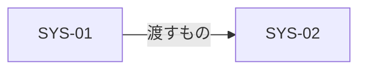

# システム

**作品**: [TITLE] | **最終更新**: [DATE]

ゲームを構成するシステムの一覧と、システムどうしのつながり。機能（`docs/feature/`）は、この一覧のシステムを組み合わせて切り出す。

## 一覧

| ID | システム | 役割（プレイヤーにとって） | 対応する柱 | コアループの層 | 主なデータ |
|---|---|---|---|---|---|
| SYS-01 | | | | 瞬間 / セッション / 長期 | |

## つながり

システムが互いに何を渡すか。入力のないシステム、出力がどこにも使われないシステムは、ループから浮いている。

| 出す側 | 受ける側 | 渡すもの | タイミング |
|---|---|---|---|

## ルール

各システムの規則（プレイヤーから見た決まり）。式と数値は `economy.md`・`progression.md` に書き、ここには書かない。

### SYS-01: [システム]

- 規則:
- 意思決定（`core-loop.md` の D の ID）:
- 例外と上限:

## 共通基盤に回す仕組み

セーブ、入力、設定、マスタデータの読み込みなど、どのゲームでも要る仕組みは、システムにせずここに挙げる。G10（`gamekit-features`）が `docs/feature/premises.md` の「基盤の候補」に移す。

| 仕組み | 必要とするシステム | 根拠 |
|---|---|---|
| <例: セーブとロード> | <例: 成長、所持品> | <GP8、core-loop.md §…> |

## 未決

| 論点 | 選択肢 | 決める時期 |
|---|---|---|
